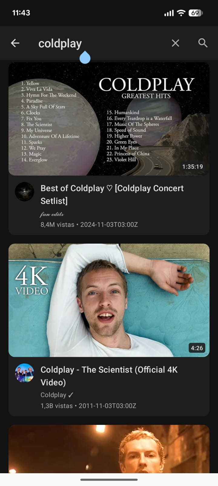
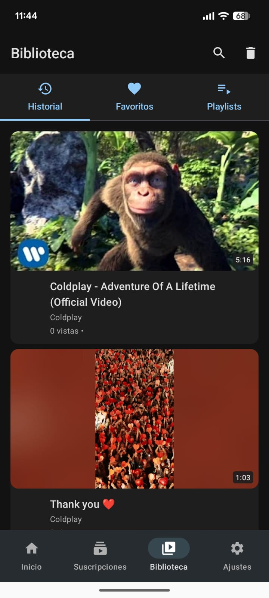
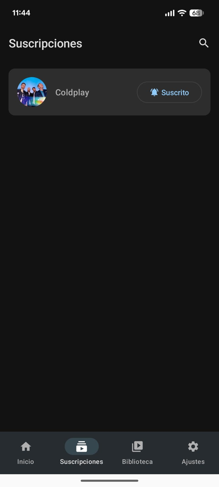
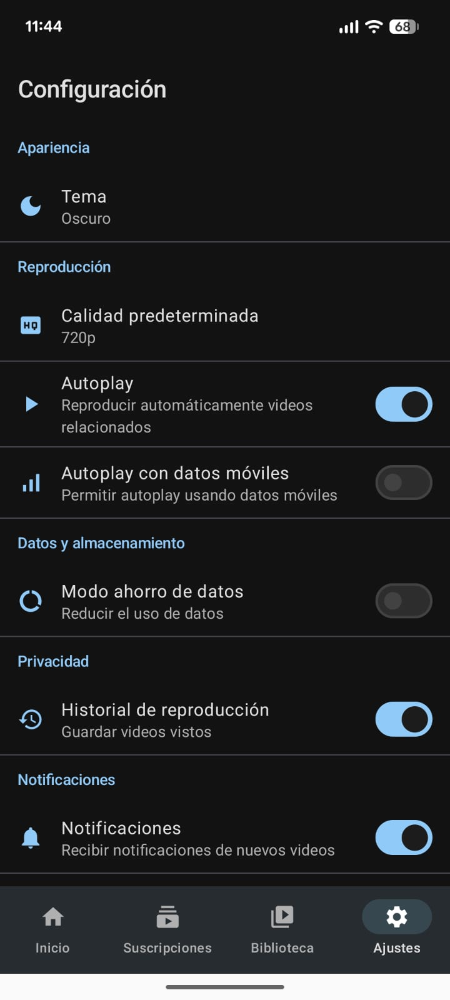

# OpenTube 📺

<div align="center">


### La forma más libre de ver YouTube en Android

**Sin anuncios • Sin seguimiento • Código abierto**

[](https://www.android.com/)
[](https://kotlinlang.org/)
[](LICENSE)

[📥 Descargar APK](https://github.com/xavigsm5/OpenTube/releases) • [🐛 Reportar Bug](https://github.com/xavigsm5/OpenTube/issues) • [💡 Sugerir Feature](https://github.com/xavigsm5/OpenTube/issues)

</div>

---

## 🌟 ¿Por qué OpenTube?

OpenTube es tu cliente de YouTube **libre, privado y sin anuncios** para Android. Inspirado en LibreTube, te permite disfrutar de todo el contenido de YouTube sin comprometer tu privacidad ni tu experiencia.

**✨ Sin anuncios molestos**  
**🔒 Tu privacidad es primero**  
**🎨 Diseño moderno con Material Design 3**  
**⚡ Rápido y eficiente**  
**📱 100% gratis y de código abierto**

---

## 🎯 Características Principales

### 🎬 Reproductor Avanzado

- **Modo mini reproductor** - Sigue navegando mientras ves videos
- **Picture-in-Picture** - Multitarea sin interrupciones
- **Controles personalizados** - Interfaz inspirada en YouTube
- **Calidad ajustable** - Desde 144p hasta 4K
- **Reproducción automática** - Experiencia fluida
- **Gesto de deslizamiento** - Minimiza con un simple gesto

### 🔍 Búsqueda y Descubrimiento

- **Historial de búsqueda** - Tarjetas Material 3 con tu historial
- **Sugerencias inteligentes** - Autocompletado mientras escribes
- **Tendencias** - Descubre videos populares
- **Búsqueda avanzada** - Filtra por videos, canales o playlists

### 💾 Gestión de Contenido

- **Favoritos** - Guarda tus videos preferidos
- **Historial** - Accede a tus videos recientes
- **Suscripciones** - Sigue tus canales favoritos
- **Playlists personalizadas** - Organiza tu contenido

### 💬 Interacción Social

- **Comentarios completos** - Lee y navega por comentarios
- **Respuestas anidadas** - Conversaciones organizadas
- **Fechas relativas** - "hace 2 días", fácil de entender
- **Links clickeables** - Descripciones HTML renderizadas

### 🎨 Diseño Moderno

- **Material Design 3** - Lo último en diseño de Google
- **Modo oscuro** - Automático según tu sistema
- **Tema verde militar** - Identidad visual única
- **Animaciones fluidas** - Transiciones suaves
- **Colores dinámicos** - Personalización total

---

## 📱 Capturas de Pantalla

<div align="center">

*Las capturas de pantalla se agregarán próximamente en la carpeta [screenshots](./screenshots)*

**Mientras tanto, descarga la app y descubre por ti mismo todas las características de OpenTube** 🚀

</div>

---

## � Capturas de Pantalla

<div align="center">

### 🏠 Inicio y Búsqueda
  

### 🎬 Reproductor de Video
  

### 📺 Canales y Configuración
  

</div>

---

## �🚀 Instalación

### Descarga Directa

1. Ve a [Releases](https://github.com/xavigsm5/OpenTube/releases)
2. Descarga el archivo `app-debug.apk`
3. Instala en tu dispositivo Android (permite fuentes desconocidas)

### Compilar desde el código

```bash
git clone https://github.com/xavigsm5/OpenTube.git
cd OpenTube
./gradlew assembleDebug
```

El APK estará en `app/build/outputs/apk/debug/app-debug.apk`

---

## 🛠️ Tecnologías

Este proyecto utiliza las tecnologías más modernas del ecosistema Android:

| Tecnología | Uso |
|------------|-----|
| **Kotlin** | Lenguaje principal (100%) |
| **Jetpack Compose** | UI moderna y declarativa |
| **Material 3** | Sistema de diseño de Google |
| **ExoPlayer (Media3)** | Reproducción de video profesional |
| **Dagger Hilt** | Inyección de dependencias |
| **Retrofit** | Cliente HTTP |
| **Room** | Base de datos local |
| **Coroutines + Flow** | Programación asíncrea |
| **Coil** | Carga eficiente de imágenes |
| **DataStore** | Almacenamiento de preferencias |

---

## 🏗️ Arquitectura

OpenTube sigue las **mejores prácticas de Android**:

- **MVVM** (Model-View-ViewModel)
- **Clean Architecture** con separación de capas
- **Repository Pattern** para abstracción de datos
- **Uso de Flows** para datos reactivos
- **Inyección de dependencias** con Hilt
- **Compose Navigation** para navegación declarativa

---

## 🔒 Privacidad

Tu privacidad es nuestra prioridad:

- ✅ **Sin seguimiento** de ningún tipo
- ✅ **Sin cuenta de Google** requerida
- ✅ **Sin telemetría** ni analytics
- ✅ **Código abierto** - Verifica tú mismo
- ✅ **Datos locales** - Todo se guarda en tu dispositivo
- ✅ **API de Piped** - Backend respetuoso con la privacidad

---

## 📄 Licencia

```
OpenTube - Cliente de YouTube libre y de código abierto
Copyright (C) 2025  OpenTube Contributors

Este programa es software libre: puedes redistribuirlo y/o modificarlo
bajo los términos de la Licencia Pública General GNU publicada por
la Free Software Foundation, ya sea la versión 3 de la Licencia, o
(a tu elección) cualquier versión posterior.

Este programa se distribuye con la esperanza de que sea útil,
pero SIN NINGUNA GARANTÍA; sin siquiera la garantía implícita de
COMERCIABILIDAD o IDONEIDAD PARA UN PROPÓSITO PARTICULAR. Consulta la
Licencia Pública General GNU para más detalles.
```

Consulta el archivo [LICENSE](LICENSE) para más información.

---

## 🤝 Contribuir

¡Las contribuciones son bienvenidas! Si quieres ayudar:

1. **Fork** el repositorio
2. Crea una **rama** para tu feature (`git checkout -b feature/AmazingFeature`)
3. **Commit** tus cambios (`git commit -m 'Add: amazing feature'`)
4. **Push** a la rama (`git push origin feature/AmazingFeature`)
5. Abre un **Pull Request**

### Ideas para contribuir

- 🐛 Reportar y corregir bugs
- 💡 Sugerir nuevas características
- 🌍 Añadir traducciones
- 📝 Mejorar la documentación
- 🎨 Diseñar iconos o recursos

---

## 🙏 Agradecimientos

- **[LibreTube](https://github.com/libre-tube/LibreTube)** - Inspiración principal
- **[Piped](https://github.com/TeamPiped/Piped)** - API backend
- **[NewPipe](https://github.com/TeamNewPipe/NewPipe)** - Extractor de YouTube
- Comunidad de **Android Open Source**

---

## 📞 Contacto

- **GitHub Issues**: [Reportar problema](https://github.com/xavigsm5/OpenTube/issues)
- **Discussions**: [Discusiones](https://github.com/xavigsm5/OpenTube/discussions)

---

<div align="center">

**⭐ Si te gusta OpenTube, dale una estrella en GitHub ⭐**

Hecho con ❤️ por la comunidad open source

</div>

- **Sin permisos innecesarios** - Solo lo esencial

### Estructura del Proyecto

---

```

## 📸 Capturas de Pantallacom.opentube/

├── data/

| Inicio | Reproductor | Mini Player |│   ├── api/           # Servicios de API (Piped)

|--------|-------------|-------------|│   ├── local/         # Base de datos Room

| Vista principal con videos trending | Reproductor de video full-featured | Mini reproductor flotante |│   ├── models/        # Modelos de datos

│   └── repository/    # Repositorios

| Búsqueda | Canal | Comentarios |├── di/                # Módulos de Hilt

|----------|-------|-------------|├── ui/

| Búsqueda avanzada de videos | Vista de canal con videos | Sistema de comentarios completo |│   ├── components/    # Componentes reutilizables

│   ├── navigation/    # Configuración de navegación

---│   ├── screens/       # Pantallas de la app

│   └── theme/         # Tema Material 3

## 🚀 Instalación└── utils/             # Utilidades


### Descarga Directa (Recomendado)```


1. Ve a [Releases](../../releases)## 🚀 Compilación

2. Descarga el APK más reciente (`app-debug.apk`)

3. Instala en tu dispositivo Android### Requisitos


### Desde el código fuente- Android Studio Hedgehog | 2023.1.1 o superior

- JDK 17

#### Requisitos- Android SDK 34

- Android Studio Hedgehog o superior- Gradle 8.2

- JDK 17 o superior

- SDK de Android (API 26+)### Pasos para compilar


#### Pasos1. **Clona el repositorio**

```bash   ```bash

# 1. Clonar el repositorio   git clone https://github.com/tu-usuario/OpenTube.git

git clone https://github.com/tu-usuario/OpenTube.git   cd OpenTube

cd OpenTube   ```


# 2. Compilar el APK2. **Abre el proyecto en Android Studio**

./gradlew assembleDebug   - File → Open → Selecciona la carpeta del proyecto


# 3. Instalar en dispositivo conectado3. **Sincroniza Gradle**

./gradlew installDebug   - El proyecto sincronizará automáticamente las dependencias

```

4. **Ejecuta la aplicación**

O abre el proyecto en Android Studio y presiona "Run" ▶️   - Conecta un dispositivo Android o inicia un emulador

   - Haz clic en el botón "Run" (▶️)

---

## 📱 Capturas de Pantalla

## 🛠️ Tecnologías Utilizadas

_Próximamente..._

### Stack Principal

- **Kotlin** - Lenguaje de programación moderno## 🔧 Configuración de la API

- **Jetpack Compose** - UI declarativa

- **Material 3** - Design system de GoogleOpenTube utiliza instancias públicas de Piped API. La instancia predeterminada es:

- **Coroutines & Flow** - Programación asíncrona- `https://pipedapi.kavin.rocks/`

- **Hilt** - Inyección de dependencias

Puedes cambiar la instancia en `NetworkModule.kt` si prefieres usar otra:

### Reproducción de Video```kotlin

- **ExoPlayer (Media3)** - Reproductor de video robustoprivate const val BASE_URL = "https://pipedapi.kavin.rocks/"

- **DASH & HLS** - Streaming adaptativo```

- **NewPipe Extractor** - Extracción de datos de YouTube

### Instancias alternativas:

### Arquitectura- `https://api.piped.video/`

- **MVVM** - Model-View-ViewModel- `https://pipedapi.tokhmi.xyz/`

- **Clean Architecture** - Separación de capas- `https://pipedapi.moomoo.me/`

- **Repository Pattern** - Abstracción de datos

- **Room Database** - Persistencia local## 🛣️ Roadmap


### Navegación### ✅ Implementado

- **Jetpack Navigation** - Navegación entre pantallas- [x] Estructura base del proyecto

- **Material Motion** - Transiciones animadas- [x] Integración con API Piped

- [x] Material Design 3

---- [x] Pantalla de inicio (Trending)

- [x] Búsqueda de videos

## 📋 Características Detalladas- [x] Base de datos local

- [x] Navegación

### Reproductor de Video

### 🚧 En desarrollo

#### Modos de Visualización- [ ] Reproductor de video con ExoPlayer

- **Modo retrato** - Controles reorganizados- [ ] Pantalla de canal

  - Tiempo de reproducción arriba- [ ] Gestión de suscripciones

  - Barra de progreso debajo del tiempo- [ ] Historial de reproducción

  - Botón fullscreen en la parte superior- [ ] Playlists personalizadas

  - Sin overlays oscuros innecesarios

- **Modo horizontal** - Pantalla completa optimizada### 📅 Futuro

  - Controles minimalistas- [ ] Descarga de videos

  - Banner transparente eliminado- [ ] Modo Picture-in-Picture

  - Posicionamiento perfecto de botones- [ ] Configuraciones avanzadas

- [ ] Reproducción en segundo plano

#### Calidad de Video- [ ] Soporte para Shorts

- Selección manual de calidad (144p - 4K)- [ ] Comentarios

- Cambio de calidad en tiempo real- [ ] Estadísticas de uso

- Mantiene la posición de reproducción

- Soporte para DASH (video + audio separados)## 🤝 Contribuir

- Soporte para Progressive streams (combinados)

- Fallback a HLS cuando es necesarioLas contribuciones son bienvenidas! Si quieres contribuir:


#### Mini Reproductor1. Fork el proyecto

- Aparece al retroceder desde el video2. Crea una rama para tu feature (`git checkout -b feature/AmazingFeature`)

- Posicionado sobre la barra de navegación3. Commit tus cambios (`git commit -m 'Add some AmazingFeature'`)

- Controles play/pause funcionales4. Push a la rama (`git push origin feature/AmazingFeature`)

- Arrastrable hacia abajo para cerrar5. Abre un Pull Request

- Click para volver al reproductor completo

- Animaciones suaves tipo YouTube## 📄 Licencia


### Sistema de ComentariosEste proyecto está bajo la Licencia GNU General Public License v3.0 - ver el archivo [LICENSE](LICENSE) para más detalles.


#### Visualización## 🙏 Agradecimientos

- Fechas en español relativo

  - "hace 2 días", "hace 3 semanas"- [LibreTube](https://github.com/libre-tube/LibreTube) - Inspiración para este proyecto

  - Singular/plural correcto automático- [Piped](https://github.com/TeamPiped/Piped) - API backend

- Avatar del autor- [NewPipe](https://github.com/TeamNewPipe/NewPipe) - Extractor de YouTube

- Nombre del canal- Comunidad de desarrollo Android

- Verificación visible (✓)

- Contador de likes## ⚠️ Disclaimer


#### InteracciónEste proyecto no está afiliado, asociado, autorizado, respaldado por, o de ninguna manera oficialmente conectado con YouTube, Google LLC o cualquiera de sus subsidiarias o afiliados.

- Expandir/contraer descripción

- Ver respuestas (botón funcional)---

- Scroll infinito

- Carga bajo demanda<div align="center">

  Hecho con ❤️ por la comunidad

### Descripciones HTML</div>


#### Parsing Inteligente
- Links clickeables (azul subrayado)
- Saltos de línea (`<br>` → nueva línea)
- Limpieza de tags HTML
- Apertura de URLs en navegador

---

## 🎨 Personalización

### Temas
- **Verde militar** - Tema por defecto
  - Color principal: `#6B8E23` (verde oliva)
  - Color de fondo: `#3D5A27` (verde oscuro)
- **Modo oscuro** - Siempre activo para proteger tus ojos
- Material You - Adaptación dinámica de colores (Android 12+)

### Preferencias
- Calidad de video por defecto
- Modo Picture-in-Picture
- Subtítulos
- Velocidad de reproducción

---

## 🤝 Contribuir

¡Las contribuciones son bienvenidas! Aquí está cómo puedes ayudar:

### Reportar Bugs
1. Ve a [Issues](../../issues)
2. Busca si el bug ya fue reportado
3. Si no, crea un nuevo issue con:
   - Descripción clara del problema
   - Pasos para reproducirlo
   - Versión de Android
   - Capturas de pantalla (si aplica)

### Solicitar Funciones
1. Abre un issue con la etiqueta `enhancement`
2. Describe la función deseada
3. Explica por qué sería útil

### Enviar Pull Requests
1. Fork el proyecto
2. Crea una rama (`git checkout -b feature/NuevaFuncion`)
3. Commit tus cambios (`git commit -m 'Agregar nueva función'`)
4. Push a la rama (`git push origin feature/NuevaFuncion`)
5. Abre un Pull Request

### Guías de Estilo
- Usa Kotlin idiomático
- Sigue las convenciones de Material Design
- Comenta código complejo
- Escribe tests cuando sea posible

---

## 📜 Licencia

Este proyecto está licenciado bajo la Licencia GPL-3.0 - ver el archivo [LICENSE](LICENSE) para más detalles.

```
Copyright (C) 2025 OpenTube

This program is free software: you can redistribute it and/or modify
it under the terms of the GNU General Public License as published by
the Free Software Foundation, either version 3 of the License, or
(at your option) any later version.

This program is distributed in the hope that it will be useful,
but WITHOUT ANY WARRANTY; without even the implied warranty of
MERCHANTABILITY or FITNESS FOR A PARTICULAR PURPOSE.  See the
GNU General Public License for more details.
```

---

## 🙏 Agradecimientos

### Proyectos de Código Abierto
- [NewPipe](https://github.com/TeamNewPipe/NewPipe) - Inspiración y NewPipe Extractor
- [LibreTube](https://github.com/libre-tube/LibreTube) - Referencia de implementación
- [ExoPlayer](https://github.com/google/ExoPlayer) - Reproductor de video

### Tecnologías
- [Jetpack Compose](https://developer.android.com/jetpack/compose)
- [Material Design](https://material.io/)
- [Kotlin](https://kotlinlang.org/)

---

## 📞 Contacto

- **Issues**: [GitHub Issues](../../issues)
- **Discusiones**: [GitHub Discussions](../../discussions)

---

## ⚠️ Descargo de Responsabilidad

OpenTube es una aplicación de código abierto para uso educativo. No está afiliada, patrocinada ni respaldada por YouTube, Google o Alphabet Inc.

El uso de esta aplicación puede violar los Términos de Servicio de YouTube. Úsala bajo tu propio riesgo.

---

## 🗺️ Roadmap

### Versión Actual (v1.0)
- ✅ Reproducción de videos sin anuncios
- ✅ Búsqueda de videos
- ✅ Historial y favoritos
- ✅ Sistema de comentarios
- ✅ Mini reproductor flotante
- ✅ Transiciones suaves
- ✅ Selección de calidad funcional

### Próximas Versiones
- [ ] Descargas de videos
- [ ] Listas de reproducción personalizadas
- [ ] Sincronización entre dispositivos
- [ ] Modo solo audio (música)
- [ ] Bloqueo de patrocinios (SponsorBlock)
- [ ] Estadísticas de reproducción
- [ ] Soporte para múltiples cuentas
- [ ] Widget para pantalla de inicio

---

<div align="center">

**⭐ Si te gusta este proyecto, dale una estrella!**

Hecho con ❤️ usando Kotlin y Jetpack Compose

[⬆ Volver arriba](#opentube-)

</div>
